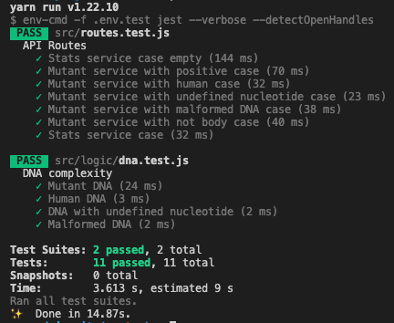
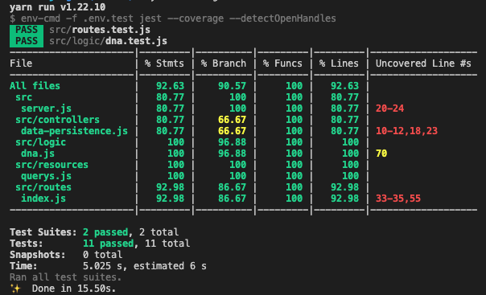

# Prueba X-Men

La solución propuesta fue desarrollada con Node.js LTS, Express, PostgreSQL y Jest para TDD (Pruebas unitarias diseñadas inicialmente para posterior desarrollo). Se uso Clean Arquitecture como base organizacional, esta documentado y codificado con estandades ECMAScript.

### Instrucciones de uso:

Como requisito se debe tener Node.js LTS, yarn y Docker Compose. La base de datos esta pre-configurada, se puede encontrar como **x-men** y para pruebas unitarias como **x-men-test**, su única tabla se llama *dnas*.

Las configuraciónes de entorno anexadas como parte de la prueba, están listas para modo **desarrollo** (.env.development), **test** (.env.test) y **producción** (.env).

La url del enpoint es */api/v1* y sus rutas son */mutant* y */stats*.

###### Para inicializar la base de datos PostgreSQL
```
docker-compose -f docker-compose-local.yml up -d postgresql
```

###### Prueba en desarrollo local: http://localhost:2020/api/v1
```
yarn install
yarn start:dev
```

###### Pruebas unitarias (configurado con V8)
```
yarn test
```
<p align="center">
  
</p>

###### Prueba de cobertura con reportes *(coverage > 90%)*
```
yarn coverage
```
<p align="center">
  
</p>

###### Despliegue local con Docker: http://localhost/api/v1
```
docker-compose -f docker-compose-local.yml up -d
```

###### URL Publica con AWS EC2 y Docker, despliegue productivo ejecutado con docker-compose.yml: http://x-men.neme.xyz/api/v1/stats
